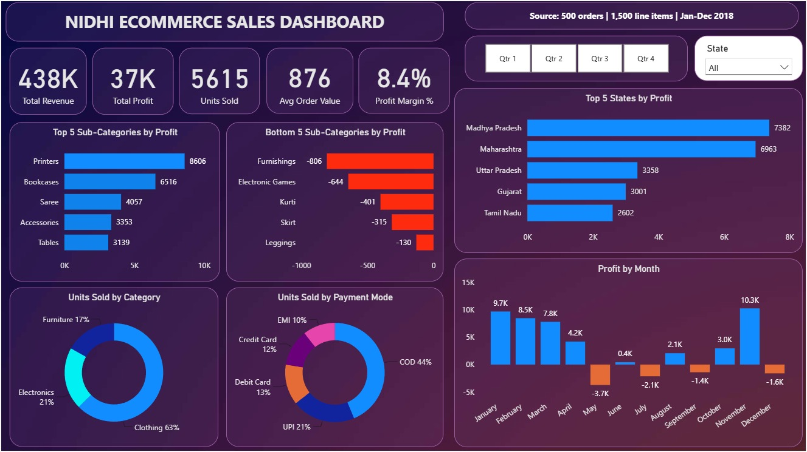
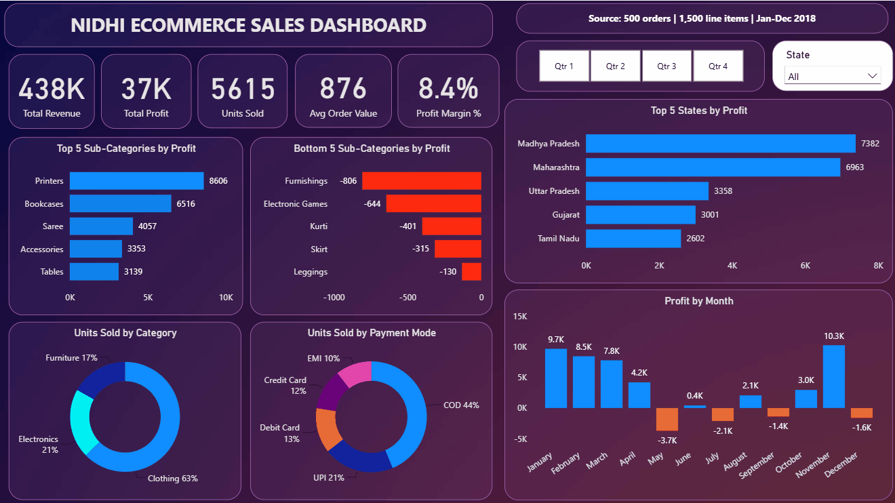
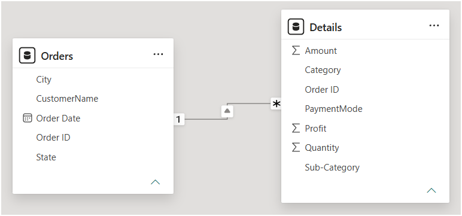

# 📊 E-Commerce Sales Dashboard | Power BI

An interactive Power BI dashboard that analyses sales, profit and payment behaviour of an e-commerce store
(500 orders, 1,500 line items, Jan-Dec 2018), built with Power Query, a two-table data model and DAX measures.

### Interactive demo

Quarter buttons and the State slicer filter every visual, and clicking any bar or slice cross-highlights the rest of the dashboard.

## Dataset
Source: <add the name or link of where you downloaded the dataset>
- `Orders.csv` (500 rows): Order ID, Order Date, CustomerName, State, City
- `Details.csv` (1,500 rows): Order ID, Amount, Profit, Quantity, Category, Sub-Category, PaymentMode

## Data preparation (Power Query)
- Loaded both CSVs and set data types (Order ID as text, Order Date as date)
- Validated the data: no nulls, duplicates or orphan Order IDs
- Trimmed text fields (State, City, CustomerName); one state had trailing spaces

## Data model
`Orders` to `Details`, one-to-many on Order ID (one order has many line items).

## DAX measures
Total Revenue, Total Profit, Units Sold, Total Orders, AOV (Revenue / Orders),
Profit Margin % (Profit / Revenue), Loss Line % (share of line items with negative profit, shown on the dashboard as "Loss Items %").

## Dashboard features
- 5 KPI cards: Total Revenue, Total Profit, Loss Items %, Avg Order Value, Profit Margin %
- Quarter buttons and State slicer, with cross-filtering across all visuals
- Top 5 states by profit; Top 5 and Bottom 5 sub-categories by profit
- Monthly profit trend; units sold by category and by payment mode
- Loss-making sub-categories and months are highlighted in red

## Key insights
- Revenue 437,771 | Profit 36,963 | 5,615 units | AOV 875.54 | Profit margin 8.4%
- 35.3% of line items are loss-making, which keeps the overall margin low
- Madhya Pradesh leads on profit (7,382) while Maharashtra leads on revenue, so sales rank alone does not show profit rank
- Rajasthan and Andhra Pradesh are loss-making states
- 5 of 17 sub-categories lose money (total -2,296): Furnishings (-806), Electronic Games (-644), Kurti (-401), Skirt (-315) and Leggings (-130)
- Printers earns the most (8,606), followed by Bookcases (6,516) and Saree (4,057)
- Profit is negative in May, Jul, Sep and Dec; November peaks at 10.3K
- Clothing is 63% of units sold; Cash on Delivery is 44% of units, UPI 21%

## How to run
Keep `Orders.csv` and `Details.csv` in one folder, open the `.pbix` in Power BI Desktop,
update the Source path of both queries in Power Query to that folder, and click Refresh.

## Author
Nidhi Gupta | [LinkedIn](https://www.linkedin.com/in/nidhigupta1997) | [GitHub](https://github.com/nidhigupta868714-ai)
